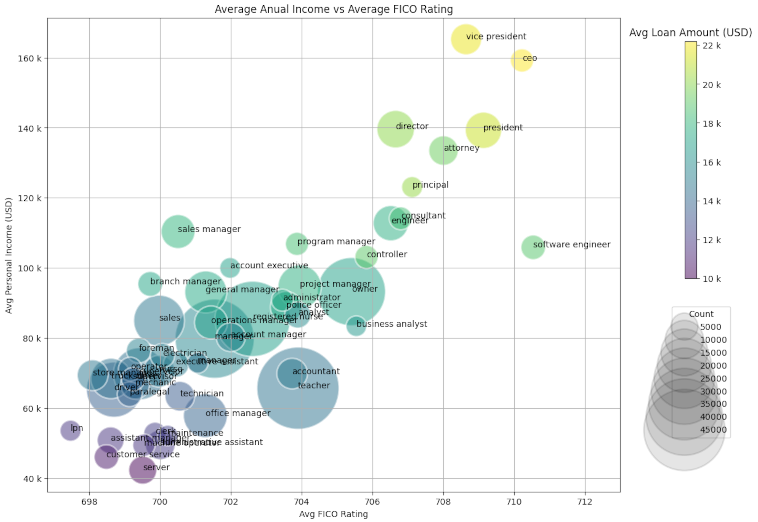

# Data Science Portfolio

This portfolio is a continuous work in progress with the purpose of showcasing data science projects I have build for my owen, please feel free to download the code from the repositories and try it yourself, in case you have any questions or suggestions please contact me at my email. Thanks for visiting.

## Projects

### Machine Learning Projects

#### Data Visualization

This porject takes a large uncleaned dataset of loan records and explores the data with visual tools to uncover hidden trends and interesting insights that help build an intuition of the information contained within.

[Project Jupyter](https://github.com/cmherrera/portfolio/blob/main/assets/projects/Financial_Analysis/Financial_Analysis.ipynb)

[comment]: #### Prediction models (Basic steps) py + R
[comment]: #### Classification
[comment]: ####	Hand writing recognition
[comment]: ####	CERN Data Projects
[comment]: ####	NASA Data Project

### Data Engineering: 
[comment]: ####	Distributed computing project
[comment]: ####	SQL Pipeline
[comment]: ####	Flow Chart of Costa Rica’s Expend Report 
[comment]: ####	AWS Project
[comment]: ####	Create API
[comment]: ####	DIY Data Center

### AI:
[comment]: ####	Apply LLM Assistant 
